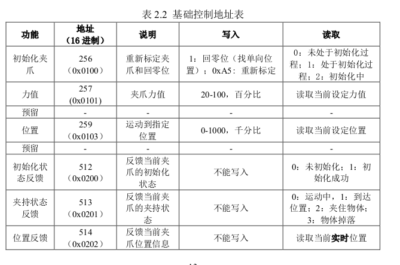
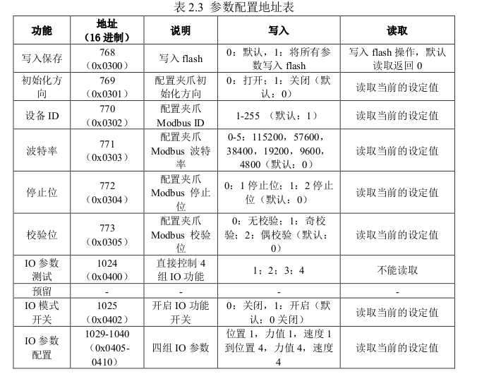

# AG_95 Control
## 中文
### 环境
>">=ubuntu18
> 
> python3

### 配置
#### 打开串口权限
>sudo chmod 777 /dev/ttyUSB0 
> 
>sudo usermod -aG　dialout {userName}
> 
> reboot
#### 安装必要项
> pip install crcmod
> pip install pyserial
### 使用

上表功能一一对应[DaHuanFinger.py](/AG-95Control.py)中ComSwitch中函数。
